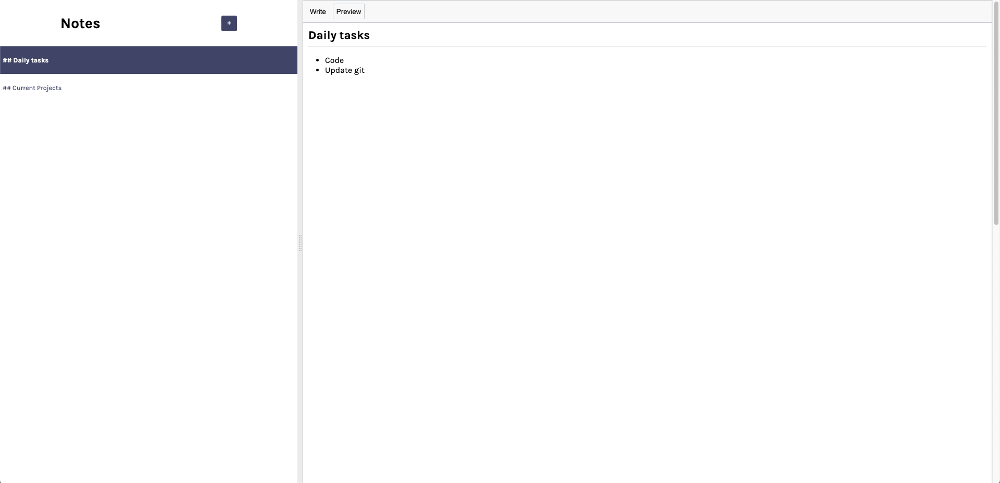

# Notes App

## Overview

This is a React-based Notes App that allows users to create, edit, and delete notes. It leverages Firebase for real-time data synchronization and features a split view for better usability. 

## Features

- **Real-time Synchronization**: Uses Firebase Firestore to keep notes updated in real time.
- **Note Creation**: Allows users to create new notes with a default template.
- **Note Editing**: Edits to notes are automatically saved with a debounce mechanism.
- **Note Deletion**: Users can delete notes, and changes are reflected immediately.
- **Split View**: Utilizes `react-split` for a resizable sidebar and editor.
- **Markdown Support**: Notes are written in Markdown for rich formatting.

## Installation

1. Clone the repository:
    ```bash
    git clone https://github.com/shanker96/notesReactApp.git
    ```
2. Install dependencies:
    ```bash
    npm install
    ```
3. Set up Firebase:
    - Add your Firebase project configuration in `firebase.js`.

4. Run the project:
    ```bash
    npm start
    ```

## Components

- **Sidebar**: Displays a list of notes and allows users to create or delete notes.
- **Editor**: A text editor for writing and editing notes with Markdown support.

## App screenshots

### Write mode


### Preview mode
